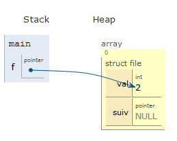

# Introduction


Dans cette partie du cours, des structures de données simples construites à l'aide de pointeurs seront abordées: 
- les piles
- les files
- les listes ordonnées

L'utilisation de pointeurs, de l'allocation dynamique et du chaînage va constituer une solution pour travailler sur un nombre d'éléments non connu 
au préalable, contrairement aux vecteurs de taille fixe. 


## Les piles
Les piles (stacks en anglais)correspondent au principe LIFO : Last In First Out.
Pour comprendre le principe de pile chaînée, il est utile de représenter la mémoire (la pile du programme et le heap).
Soit la structure C suivante qui va permettre de construire une pile d'entiers :
```C
struct pile{
  int val;
  struct pile * prec;
};
```
### L'état initial de la pile 
Au départ, la pile est vide, elle ne contient aucun élément :
```C
struct pile *p;
```


### L'ajout d'un élément : l'opération `push()`

Les éléments 2, 1 et 10 (valeurs servant pour l'exemple) sont insérés sur la pile dans cet ordre. 
On observe que le pointeur p ainsi que le heap est modifié à chaque ajout. Chaque élément possède un pointeur prec qui permet de désigner l'élément inséré précédemment.
La représentation de la mémoire à chaque étape est la suivante :
 
|push d'un element|push d'un deuxième élément|push d'un troisième élément|
|---------------|---------------|---------------|
|||| 

### La supression d'un élément : l'opération `pop()`
Si la pile n'est pas vide  , l'opération `pop()` va permettre de récupérer et retirer l'élément à son sommet. Dans certaines implémentations, une opération `top()` permet
d'accéder à l'élément au sommmet de la pile sans le retirer alors que `pop()` le retire sans le renvoyer.
Dans l'exemple, la mémoire allouée sur le heap pour l'élément est récupérée.
L'élément 10 désigné par p est retiré et la pile se retrouve dans l'état suivant:


## Les files
Les files (queues) correspondent au principe FIFO : First In First Out.
```C
struct file{
  int val;
  struct file * suiv;
};
```
### L'état initial de la file 
Au départ, la file est vide, elle ne contient aucun élément :
```C
struct file *f;
```


### L'ajout d'un élément : l'opération `enqueue()`
Lorsque la file est vide, le pointeur de tête est modifié. Dans le cas contraire, il ne l'est pas et le nouvel élément est ajouté en fin de liste.

|enqueue d'un element|enqueue d'un deuxième élément|enqueue d'un troisième élément|
|---------------|---------------|---------------|
|||| 

### La récupération d'un élément : l'opération `dequeue()`
Si la file n'est pas vide  , l'opération `dequeue()` va permettre de récupérer et retirer le premier élément de la file.
La mémoire allouée sur le heap pour l'élément est récupérée.
Dans l'exemple, l'élément 2 désigné par f est retiré et la file se retrouve dans l'état suivant:


## Les listes ordonnées

Sur une liste ordonnées, les opérations classiques que l'on peut réaliser sont :

- insérer un élément
- supprimer un élément
- rechercher un élément
- tester si la liste est vide
- obtenir le nombre d'éléments présents

### Insérer un élément : `insert()`

Un élément peut être insérer en tête, au sein ou en fin de liste selon sa valeur. Dans l'exemple ci-dessous, un élément de valeur 3 est inséré au sein de la liste et l'élément
5 sera insérer en fin de liste ordonnée.

|insert d'un element dans la liste|insert d'un élément en fin de liste|
|---------------|---------------|
|||

### Supprimer un élément  : `remove()`
L'élément à supprimer peut se trouver en tête , au sein de la liste ou en fin de liste.
L'opération permettra de retirer l'élément du chaînage et de désallouer la mémoire qu'il occupait sur le heap.


